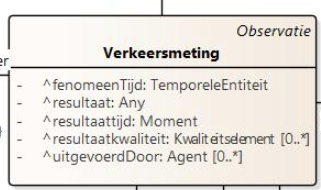

# Verkeersmeting

De dataset beschrijft het aantal fietsers dat is gedetecteerd door een verkeerssensor _:mti001, uitgevoerd op een verkeersmeetpunt _:mpt001, gedurende een bepaalde periode :_fenomtime001. Het ´type´ veld geeft aan dat de sensor alleen fietsers meet, en het ´aantal´ veld geeft aan dat er geen fietsers zijn waargenomen.

```json
"type": "FIETSERS",
"aantal": 60
```

Aangezien er geen specifieke definities (a.d.h. van codelijsten) bestaan voor voertuitgtypes (bv. auto, fiets, enz.) en verkeerskenmerktype (bv. aantal, snelheid, enz.) dienen deze in codelijsten worden gedefinieerd.
Deze werden hier uitgewerkt:
[](https://data.vlaanderen.be/doc/conceptscheme/VkmVoertuigTypes/)
[](https://data.vlaanderen.be/doc/concept/VkmVerkeersKenmerkType/)

"Verkeerskenmerk.voertuigType": "cl-vrt:fiets" verwijst dus naar 
[](https://data.vlaanderen.be/doc/concept/VkmVerkeersKenmerkType/fiets).

Via het OSLO model verkeersmetingen, is het mogelijk om volgende klassen te gaan definiëren:


Het teken '^' geeft aan, dat deze klassen zijn overgeërfd van een ander applciatieprofiel.

```json
{
  "@context": [
 "https://data.vlaanderen.be/doc/applicatieprofiel/verkeersmetingen/ontwerpstandaard/2023-03-14/context/Verkeersmetingen-ap.jsonld",
 "cl-vrt": "https://data.vlaanderen.be/doc/concept/VkmVoertuigTypes/",
 "cl-vkt": "https://data.vlaanderen.be/doc/concept/VkmVerkeersKenmerkType/",
],

   "@graph": [
    {
      "@id": "_:vrm001",
      "@type": "Verkeersmeting",
      "Verkeersmeting.geobserveerdKenmerk": {
        "@type": "Verkeerskenmerk",
        "Verkeerskenmerk.type": "cl-vkt:aantal",
        "Verkeerskenmerk.voertuigType": "cl-vrt:fiets"
      },
      "Verkeersmeting.resultaat": 60,
      "Verkeersmeting.uitgevoerdDoor": "_:mti001",
      "Verkeersmeting.geobserveerdObject": "_:mpt001",
      "Verkeersmeting.fenomeenTijd": ":_fenomtime001"
    }
   ]

```


# Verkeersmeting.fenomeenTijd

De bron data geeft de tijdperiode met de velden `van` en `tot`:

```json
"van":"2023-06-01 00:00:00.0",
"tot": "2023-06-01 00:15:00.0",
```

De data mapping hiervan is `Verkeersmeting.fenomeenTijd`. 

```json
"Verkeersmeting.fenomeenTijd": {
        "@type": "time:ProperInterval",
        "time:hasBeginning": {
          "@type": "time:Instant",
          "time:inXSDDateTime": {
            "@type": "xml-schema:dateTime",
            "@value": "20230601T00:00:00.000"
          }
        },
        "time:hasEnd": {
          "@type": "time:Instant",
          "time:inXSDDateTime": {
            "@type": "xml-schema:dateTime",
            "@value": "20230601T00:00:15.000"
          }
        }
      }
```