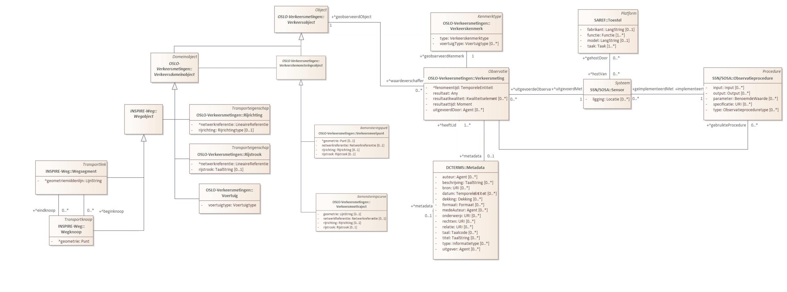

# Geomobility

```note
Deze OSLO mapping heeft nog GEEN cross check ondergaan, er kunnen nog wijzigingen gebeuren na cross check. Het vereenvoudigd implementatiemodel (overview figuur) wordt later nog gefinaliseerd.
```

<div style="text-align: left;"></div>


Floating Car Data geeft een zeer goed beeld van de verkeerssituatie in een stad, maar soms is het essentieel om exact te weten hoeveel verkeer er in beide richtingen door een straat rijdt en wat de modal split is.

Denk hierbij aan:
- Het evalueren van een nieuw circulatieplan
- Het invoeren van een nieuwe lichtregeling
- Het analyseren van de overlast bij wegenwerken en sluipverkeer
- Het kalibreren van ANPR
- De effecten van een fietsstraat

Afhankelijk van de doelstelling wordt een hardware-module gekozen. Afhankelijk van de locatie, te onderzoeken modi, duurtijd, etc. selecteren we één van de volgende toestellen:

- Telslangen
- Radar
- Camera’s
- ANPR-camera’s

## Vereenvoudigd implementatie model

<div id="enlargeImage">
<a href="https://raw.githubusercontent.com/samuvack/Implementatie-OSLO-mapping/main/images/Fietstellus_overview.jpg"></a>
</div>


## Data input

### Voorbeeld site


```json
{
  "id": "05d50e16-2e4e-414a-921a-91a1ea11cb02",
  "name": "Site 38",
  "address": "Noorweegse Kaai",
  "geometry": {
    "type": "Point",
    "coordinates": [
      3.2421013712883,
      51.2257868862067
    ]
  },
  "country": "BE",
  "subdivision": "BE-BRU",
  "origins": [
    {
      "name": "A",
      "geometry": {
        "type": "Point",
        "coordinates": [
          3.24239104986191,
          51.2259355430829
        ]
      }
    },
    {
      "name": "B",
      "geometry": {
        "type": "Point",
        "coordinates": [
          3.24177950620651,
          51.2256331896095
        ]
      }
    }
  ]
}
```
### Voorbeeld meeting

```json
{
    "id" : "5ff87dcd9dc02be13c259e28",
    "type" : "atc",
    "origin" : "A",
    "destination" : "B",
    "classification" : "PCL",
    "timestamp" : "2016-11-22T09:00:00.000Z",
    "count" : 5,
    "poiId" : "05d50e16-2e4e-414a-921a-91a1ea11cb02",
    "surveyId" : "b18222b9-7cd9-4c3c-adbe-41c0c597ee7d"
}

```

## OSLO mapping


```json
{
    "@context": [
        "https://data.vlaanderen.be/doc/applicatieprofiel/verkeersmetingen/ontwerpstandaard/2023-03-14/context/Verkeersmetingen-ap.jsonld",
        "https://data.vlaanderen.be/doc/applicatieprofiel/sensoren-en-bemonstering/kandidaatstandaard/2022-04-28/context/ap-sensoren-en-bemonstering.jsonld",
        "https://data.vlaanderen.be/doc/applicatieprofiel/observaties-en-metingen/kandidaatstandaard/2022-04-28/context/ap-observaties-en-metingen.jsonld",
        "https://raw.githubusercontent.com/samuvack/context/main/wegenregister.jsonld",
        "https://raw.githubusercontent.com/samuvack/context/main/DCAT_context.json",
        "https://data.vlaanderen.be/doc/applicatieprofiel/generiek-basis/zonderstatus/2019-07-01/context/generiek-basis.jsonld",
        {
            "schema": "http://schema.org/",
            "dct": "http://purl.org/dc/terms/",
            "xsd": "http://www.w3.org/2001/XMLSchema#",
            "geosparql": "http://www.opengis.net/ont/geosparql#",
            "qudt-unit": "http://qudt.org/vocab/unit/",
            "qudt-schema": "https://qudt.org/schema/qudt/",
            "dcterms": "http://purl.org/dc/terms/",
            "time": "http://www.w3.org/2006/time#",
            "adms": "http://www.w3.org/ns/adms#",


            "cl-idt": "https://data.vlaanderen.be/doc/conceptscheme/VkmIdentificatorType/",
            "cl-vrt":"https://data.vlaanderen.be/doc/conceptscheme/VkmVoertuigTypes/",
            "cl-vkt": "https://data.vlaanderen.be/doc/conceptscheme/Vkmverkeerskenmerktype/",
            "cl-trt" : "https://inspire.ec.europa.eu/codelist/LinkDirectionValue/",
            "cl-mit": "https://data.vlaanderen.be/doc/conceptscheme/VkmMeetInstrumentType/",
            "cl-op": "https://data.vlaanderen.be/doc/conceptscheme/VkmObservatieProcedure/",
            "cl-access": "http://publications.europa.eu/resource/authority/access-right/"
            
        }
    ],
    "@graph": [
        {
            "@id": "_:GM001",
            "@type": "Dataset",
            "Dataset.titel": {
                "@language": "nl",
                "@value": "GeoMobility."
            },
            "Dataset.beschrijving": [
                {
                    "@language": "nl",
                    "@value": "Floating Car Data geeft een zeer goed beeld van de verkeerssituatie in een stad, maar soms is het essentieel om exact te weten hoeveel verkeer er in beide richtingen door een straat rijdt en wat de modal split is."
                }
            ],
            "Dataset.toegankelijkheid": "cl-access:PUBLIC",
            "Dataset.trefwoord": [
                {
                    "@language": "nl",
                    "@value": "GeoMobility"
                }
            ]
        },
        {
            "@id": "_:rri001",
            "@type": "Rijrichting",
            "Rijrichting.netwerkreferentie": {
                "@type": "LineaireReferentie",
                "Netwerkreferentie.element": "_:wgs001",
                "Linkreferentie.toepassingsRichting": "cl-trt:gelijklopend"
            },
            "Rijrichting.rijrichting": "cl-trt:gelijklopend"
        },
        
              {
            "@id":"_:wgs001",
            "@type":"Wegsegment",
            "Wegsegment.beginknoop":"_:wgkn001",
            "Wegsegment.eindknoop":"_:wgkn002"
        },
        {
            "@id": "_:wgkn001",
            "@type": "Wegknoop",
            "Wegknoop.geometrie": {
                "@type": "Punt",
                "Geometrie.gml": {
                    "@value": "<gml:Point srsName=\"http:\\//www.opengis.net/def/crs/EPSG/0/4326\"><gml:coordinates> 3.24239104986191, 51.2259355430829</gml:coordinates><gml:Point>",
                    "@type": "geosparql:gmlliteral"
                }
        }
        },
        {
            "@id": "_:wgkn002",
            "@type": "Wegknoop",
            "Wegknoop.geometrie": {
                "@type": "Punt",
                "Geometrie.gml": {
                    "@value": "<gml:Point srsName=\"http:\\//www.opengis.net/def/crs/EPSG/0/4326\"><gml:coordinates>3.24177950620651, 51.2256331896095</gml:coordinates><gml:Point>",
                    "@type": "geosparql:gmlliteral"
                }
        }
        },  
        {
            "@id": "_:vkmauto001",
            "@type": "Verkeersmeting",
            "Observatie.geobserveerdKenmerk": {
                "@type": "Verkeerskenmerk",
                "Verkeerskenmerk.type": "cl-vkt:aantal",
                "Verkeerskenmerk.voertuigType": "cl-vrt:pcl"
            },
            "Observatie.geobserveerdObject": "_:wgs001",
            "Observatie.fenomeentijd":":_fenomtime001",
            "Verkeersmeting.resultaat": 5,
            "Observatie.uitgevoerdDoor": "_:mti001",
            "Verkeersmeetpunt":"_:mpt001",
            "dct:memberOf": "_:GM001"
        },
        {
        "@id":"_:fenomtime001",
        "Observatie.fenomeentijd": {
                "@type": "time:ProperInterval",
                "time:hasBeginning": {
                    "@type": "time:Instant",
                    "time:inXSDDateTime": {
                        "@type": "xml-schema:dateTime",
                        "@value": "20161122T09:00:00.000Z"
                    }
                },
                "time:hasEnd": {
                    "@type": "time:Instant",
                    "time:inXSDDateTime": {
                        "@type": "xml-schema:dateTime",
                        "@value": "20161122T10:00:00.000Z"
                    }
                }
            }
        },
        {
                "@id":"_:mpt001", 
                "@type": "Verkeersmeetpunt",
                "Bemonsteringspunt.geometrie": {
                        "@type": "Punt",
                        "Geometrie.gml": {
                            "@value": "<gml:Point srsName=\"http:\\//www.opengis.net/def/crs/EPSG/0/4326\"><gml:coordinates>3.24177950620651, 51.2256331896095</gml:coordinates><gml:Point>",
                            "@type": "geosparql:gmlliteral"
                        }
                    },
                "Bemonsteringsobject.identificator": {
                    "@type": "Identificator",
                    "Identificator.identificator": [{
                        "@value": "5ff87dcd9dc02be13c259e28",
                        "@type": "cl-idt:verkeersmeetpuntid"
                    },{
                        "@value": "05d50e16-2e4e-414a-921a-91a1ea11cb02", 
                        "@type": "cl-idt:poiId"
                    },
                    {
                        "@value": "b18222b9-7cd9-4c3c-adbe-41c0c597ee7d",
                        "@type": "cl-idt:surveyId"
                    }
                ]},
                "Verkeersmeetpunt.rijstrook":"_rst001"},
        
        {
            "@id": "_:mti001",
            "@type": "Sensor",
            "Systeem.type": "cl-mit:atc",
            "Sensor.implementeert":{
                "@type":"Observatieproceduretype",
                "Observatieprocedure.type":"cl-opt:type"}

        }

    ]
}


```