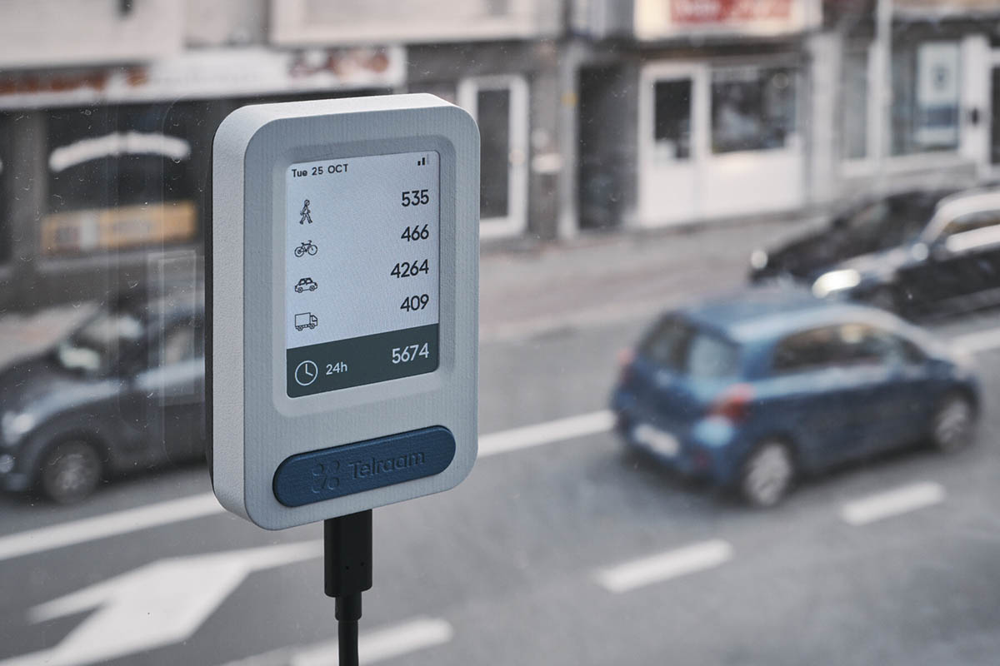
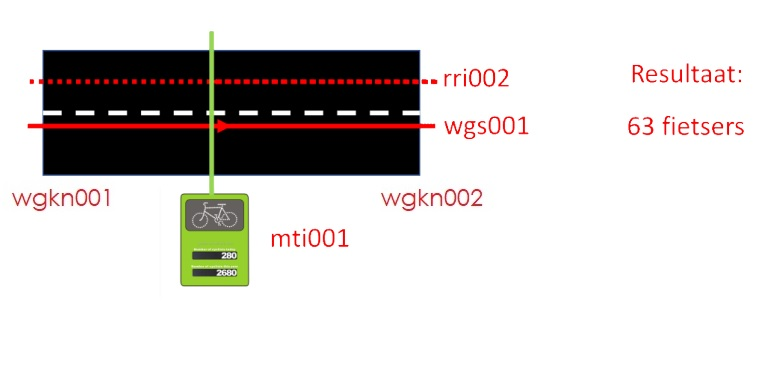

# Telraam

```note
Deze OSLO mapping heeft een cross check ondergaan en kan worden geïmplementeerd. Het vereenvoudigd implementatiemodel (overview figuur) wordt later nog gefinaliseerd.
```


<div style="text-align: left;">


Telraam is een oplossing (met burgers) voor het verzamelen van multimodale verkeersgegevens met een speciaal gebouwd, betaalbaar en gebruiksvriendelijk toestel.

Onze Telraam-toestel scant voortdurend een straat vanuit het raam van een burger en biedt cruciale gegevens over verschillende vervoerswijzen, waaronder gemotoriseerde voertuigen, fietsers, voetgangers en meer. Telraam netwerken creëren ook de mogelijkheid voor dialoog tussen verkeersplanners, lokale autoriteiten en hun communities: de burgers die leven door - en gebruiken - deze straten, door verkeer te omzetten in een open en toegankelijk Citizen Science-project.

</div>


 

Fietstelpunt 

<p align="center"></p>


## Vereenvoudigd implementatie model

<div id="enlargeImage">
<a href="https://raw.githubusercontent.com/samuvack/Implementatie-OSLO-mapping/main/images/Fietstellus_overview.jpg"></a>
</div>


## Data input

```json

{
  "status_code": 200,
  "message": "ok",
  "type": "FeatureCollection",
  "features": [
    {
      "type": "Feature",
      "geometry": {
        "type": "MultiLineString",
        "coordinates": [
          [
            [
              4.04451041920408,
              50.9346197016993
            ],
            [
              4.04468516398887,
              50.9346499094883
            ],
            [
              4.04476128017613,
              50.9346736897766
            ],
            [
              4.04486091154096,
              50.9347048165154
            ],
            [
              4.0450104190652,
              50.9347897018035
            ],
            [
              4.04508041942127,
              50.9348297017355
            ],
            [
              4.04536795581668,
              50.9349798325647
            ],
            [
              4.04561050090522,
              50.9350979049717
            ],
            [
              4.04563353497237,
              50.9351073291995
            ],
            [
              4.04581042002322,
              50.9351797011571
            ]
          ]
        ]
      },
      "properties": {
        "segment_id": 426009,
        "last_data_package": "2021-09-30 08:14:03.339300+00:00",
        "timezone": "Europe/Brussels",
        "date": "2021-09-30 06:00:00+00:00",
        "period": "hourly",
        "uptime": 0.750277777777778,
        "heavy": 26.6567937800814,
        "car": 277.230655312846,
        "bike": 33.3209922251018,
        "pedestrian": 3.99851906701222
      }
    }
]
}

```


## OSLO mapping

```json
{
    "@context": [
        "https://data.vlaanderen.be/doc/applicatieprofiel/verkeersmetingen/ontwerpstandaard/2023-03-14/context/Verkeersmetingen-ap.jsonld",
        "https://data.vlaanderen.be/doc/applicatieprofiel/sensoren-en-bemonstering/kandidaatstandaard/2022-04-28/context/ap-sensoren-en-bemonstering.jsonld",
        "https://data.vlaanderen.be/doc/applicatieprofiel/observaties-en-metingen/kandidaatstandaard/2022-04-28/context/ap-observaties-en-metingen.jsonld",
        "https://raw.githubusercontent.com/samuvack/context/main/DCAT_context.json",
        "https://data.vlaanderen.be/doc/applicatieprofiel/generiek-basis/zonderstatus/2019-07-01/context/generiek-basis.jsonld",
        {
            "schema": "http://schema.org/",
            "dct": "http://purl.org/dc/terms/",
            "xsd": "http://www.w3.org/2001/XMLSchema#",
            "geosparql": "http://www.opengis.net/ont/geosparql#",
            "qudt-unit": "http://qudt.org/vocab/unit/",
            "qudt-schema": "https://qudt.org/schema/qudt/",
            "dcterms": "http://purl.org/dc/terms/",
            "time": "http://www.w3.org/2006/time#",

            "cl-vrt":"https://data.vlaanderen.be/doc/conceptscheme/VkmVoertuigTypes",
            "cl-vkt": "https://data.vlaanderen.be/doc/conceptscheme/Vkmverkeerskenmerktype",
            "cl-mit": "https://data.vlaanderen.be/doc/conceptscheme/VkmMeetInstrumentType",
            "cl-op": "https://data.vlaanderen.be/doc/conceptscheme/VkmObservatieProcedure",
            "cl-access": "http://publications.europa.eu/resource/authority/access-right/"
        }
    ],
    "@graph": [
        {
            "@id": "https://example.com/id/telraam/dataset001",
            "@type": "Dataset",
            "Dataset.titel": {
                "@language": "nl",
                "@value": "Telraam sample 1"
            },
            "Dataset.beschrijving": [
                {
                    "@language": "nl",
                    "@value": "Telraam is een oplossing (met burgers) voor het verzamelen van multimodale verkeersgegevens met een speciaal gebouwd, betaalbaar en gebruiksvriendelijk toestel."
                },
                {
                    "@language": "en",
                    "@value": "Telraam is your citizen-powered solution for collecting multi-modal traffic data with a purpose-built, affordable, and user-friendly device."
                }
            ],
            "Dataset.toegankelijkheid": "cl-access:PUBLIC",
            "Dataset.trefwoord": [
                {
                    "@language": "nl",
                    "@value": "multimodale verkeersgegevens"
                }
            ]
        },
       
        {
            "@id": "_:wgs426009",
            "@type": "Wegsegment",
            "Wegsegment.geometriemiddenlijn": {
                "Geometrie.gml": {
                    "@value": "<gml:Point srsName=\"http:\\//www.opengis.net/def/crs/EPSG/0/4326\">50.9346197016993 4.04451041920408,50.9346499094883 4.04468516398887,50.9346736897766 4.04476128017613, 50.9347048165154 4.04486091154096,50.9347897018035 4.0450104190652,50.9348297017355 4.04508041942127,50.9349798325647 4.04536795581668,50.9350979049717 4.04561050090522, 50.9351073291995 4.04563353497237,50.9351797011571 4.04581042002322<gml:coordinates></gml:coordinates><gml:Point>",
                    "@type": "geosparql:gmlliteral"
                }
            }
        },
        {
          "@id": "_:vkmfiets001",
            "@type": "Verkeersmeting",
            "Observatie.geobserveerdKenmerk": {
                "@type": "Verkeerskenmerk",
                "Verkeerskenmerk.type": "cl-vkt:aantal",
                "Verkeerskenmerk.voertuigType": "cl-vrt:fiets"
            },
            "Observatie.geobserveerdObject": "_:wgs426009",
            "Observatie.fenomeentijd":":_fenomtime001",
            "Verkeersmeting.resultaat": 33.3209922251018,
            "Observatie.uitgevoerdDoor": "_:mti001",
            "dct:memberOf":"https://example.com/id/telraam/dataset001"
        },
        {
          "@id": "_:vkmvoet001",
            "@type":"Verkeersmeting",
            "Observatie.geobserveerdKenmerk": {
                "@type": "Verkeerskenmerk",
                "Verkeerskenmerk.type": "cl-vkt:aantal",
                "Verkeerskenmerk.voertuigType": "cl-vrt:voetganger"
            },
            "Observatie.geobserveerdObject": "_:wgs426009",
            "Observatie.fenomeentijd":":_fenomtime001",
            "Verkeersmeting.resultaat": 33.3209922251018,
            "Observatie.uitgevoerdDoor": "_:mti001",
            "dct:memberOf":"https://example.com/id/telraam/dataset001"
        },
        {
          "@id": "_:vkmzwaar001",
            "@type": "Verkeersmeting",
            "Observatie.geobserveerdKenmerk": {
                "@type": "Verkeerskenmerk",
                "Verkeerskenmerk.type": "cl-vkt:aantal",
                "Verkeerskenmerk.voertuigType": "cl-vrt:zwaarverkeer"
            },
            "Observatie.geobserveerdObject": "_:wgs426009",
            "Observatie.fenomeentijd":":_fenomtime001",
            "Verkeersmeting.resultaat": 26.6567937800814,
            "Observatie.uitgevoerdDoor": "_:mti001",
            "dct:memberOf":"https://example.com/id/telraam/dataset001"
        },
        {
          "@id": "_:vkmauto001",
            "@type": "Verkeersmeting",
            "Observatie.geobserveerdKenmerk": {
                "@type": "Verkeerskenmerk",
                "Verkeerskenmerk.type": "cl-vkt:aantal",
                "Verkeerskenmerk.voertuigType": "cl-vrt:auto"
            },
            "Observatie.geobserveerdObject": "_:wgs426009",
            "Observatie.fenomeentijd":":_fenomtime001",
            "Verkeersmeting.resultaat": 277.230655312846,
            "Observatie.uitgevoerdDoor": "_:mti001"
        },
        {
          "@id": "_:vmtauto001",
            "@type": "Verkeersmeting",
            "Observatie.geobserveerdKenmerk": {
                "@type": "Verkeerskenmerk",
                "Verkeerskenmerk.type": "cl-vkt:aantal",
                "Verkeerskenmerk.voertuigType": "cl-vrt:auto"
            },
            "Observatie.geobserveerdObject": "_:wgs426009",
            "Observatie.fenomeentijd":":_fenomtime001",
            "Verkeersmeting.resultaat": 277.230655312846,
            "Observatie.uitgevoerdDoor": "_:mti001"
        },
        {
          "@id":"_:fenomtime001",
        "Observatie.fenomeentijd": {
                "@type": "time:ProperInterval",
                "time:hasBeginning": {
                    "@type": "time:Instant",
                    "time:inXSDDateTime": {
                        "@type": "xml-schema:dateTime",
                        "@value": "20210930T06:00:00.000" 
                    }
                },
                "time:hasEnd": {
                    "@type": "time:Instant",
                    "time:inXSDDateTime": {
                        "@type": "xml-schema:dateTime",
                        "@value": "20210930T07:00:00.000"
                    }
                }
            }
        },
        {
            "@id": "_:mti001",
            "@type": "Sensor",
            "Systeem.type": "cl-mit:telraam",
            "Sensor.implementeert":{
                "@type":"Observatieproceduretype",
                "Observatieprocedure.type":"cl-op:type"}

        }
    ]
}

```

```note
Hierbij wordt gekozen om de rijrichting niet te omschrijven, net zoals dit niet gedaan wordt in de brondataset

```

Dit zou eventueel wel kunnen, door dit element toe te voegen:

```json
{
            "@id": "_:rri001",
            "@type": "Rijrichting",
            "Rijrichting.netwerkreferentie": {
                "@type": "LineaireReferentie",
                "Netwerkreferentie.element": "_:wgs426009",
                "Linkreferentie.toepassingsRichting": "cl-trt:beide"
            },
            "Rijrichting.rijrichting": "cl-trt:beide"
        }
```


## Opsplitsing

Er wordt gekozen om de dataset te splitsen en te publiceren als 2 LDES'en. 1 LDES van sensoren met hieraangekoppeld het wegsegment,
en een LDES met de observaties/tellingen.


## LDES 1: observaties


```json
{
    "@context": [
        "https://data.vlaanderen.be/doc/applicatieprofiel/verkeersmetingen/ontwerpstandaard/2023-03-14/context/Verkeersmetingen-ap.jsonld",
        "https://data.vlaanderen.be/doc/applicatieprofiel/sensoren-en-bemonstering/kandidaatstandaard/2022-04-28/context/ap-sensoren-en-bemonstering.jsonld",
        "https://data.vlaanderen.be/doc/applicatieprofiel/observaties-en-metingen/kandidaatstandaard/2022-04-28/context/ap-observaties-en-metingen.jsonld",
        "https://data.vlaanderen.be/doc/applicatieprofiel/GEODCAT-AP-VL/erkendestandaard/2022-04-21/context/geodcatap-vlaanderen.jsonld",
        "https://data.vlaanderen.be/doc/applicatieprofiel/generiek-basis/zonderstatus/2019-07-01/context/generiek-basis.jsonld",
        {
            "schema": "http://schema.org/",
            "dct": "http://purl.org/dc/terms/",
            "xsd": "http://www.w3.org/2001/XMLSchema#",
            "geosparql": "http://www.opengis.net/ont/geosparql#",
            "qudt-unit": "http://qudt.org/vocab/unit/",
            "qudt-schema": "https://qudt.org/schema/qudt/",
            "dcterms": "http://purl.org/dc/terms/",
            "time": "http://www.w3.org/2006/time#",

            "cl-vrt":"https://data.vlaanderen.be/doc/conceptscheme/VkmVoertuigTypes",
            "cl-vkt": "https://data.vlaanderen.be/doc/conceptscheme/Vkmverkeerskenmerktype",
            "cl-mit": "https://data.vlaanderen.be/doc/conceptscheme/VkmMeetInstrumentType",
            "cl-op": "https://data.vlaanderen.be/doc/conceptscheme/VkmObservatieProcedure",
            "cl-access": "http://publications.europa.eu/resource/authority/access-right/"

        }
    ],
    "@graph": [
        {
            "@id": "https://example.com/id/telraam/dataset001",
            "@type": "Dataset",
            "Dataset.titel": {
                "@language": "nl",
                "@value": "Telraam sample 1"
            },
            "Dataset.beschrijving": [
                {
                    "@language": "nl",
                    "@value": "Telraam is een oplossing (met burgers) voor het verzamelen van multimodale verkeersgegevens met een speciaal gebouwd, betaalbaar en gebruiksvriendelijk toestel."
                },
                {
                    "@language": "en",
                    "@value": "Telraam is your citizen-powered solution for collecting multi-modal traffic data with a purpose-built, affordable, and user-friendly device."
                }
            ],
            "Dataset.toegankelijkheid": "cl-access:PUBLIC",
            "Dataset.trefwoord": [
                {
                    "@language": "nl",
                    "@value": "multimodale verkeersgegevens"
                }
            ]
        },
       
        {
            "@id": "_:wgs426009",
            "@type": "Wegsegment",
            "Wegsegment.geometriemiddenlijn": {
                "Geometrie.gml": {
                    "@value": "<gml:Point srsName=\"http:\\//www.opengis.net/def/crs/EPSG/0/4326\"><gml:coordinates>50.9346197016993 4.04451041920408,50.9346499094883 4.04468516398887,50.9346736897766 4.04476128017613, 50.9347048165154 4.04486091154096,50.9347897018035 4.0450104190652,50.9348297017355 4.04508041942127,50.9349798325647 4.04536795581668,50.9350979049717 4.04561050090522, 50.9351073291995 4.04563353497237,50.9351797011571 4.04581042002322</gml:coordinates><gml:Point>",
                    "@type": "geosparql:gmlliteral"
                }
            }
        },
        {
          "@id": "_:vkmfiets001",
            "@type": "Verkeersmeting",
            "Observatie.geobserveerdKenmerk": {
                "@type": "Verkeerskenmerk",
                "Verkeerskenmerk.type": "cl-vkt:aantal",
                "Verkeerskenmerk.voertuigType": "cl-vrt:fiets"
            },
            "Observatie.geobserveerdObject": "_:wgs426009",
            "Observatie.fenomeentijd":":_fenomtime001",
            "Verkeersmeting.resultaat": 33.3209922251018,
            "Observatie.uitgevoerdDoor": "_:mti001",
            "dct:memberOf":"https://example.com/id/telraam/dataset001"
        },
        {
          "@id": "_:vkmvoet001",
            "@type":"Verkeersmeting",
            "Observatie.geobserveerdKenmerk": {
                "@type": "Verkeerskenmerk",
                "Verkeerskenmerk.type": "cl-vkt:aantal",
                "Verkeerskenmerk.voertuigType": "cl-vrt:voetganger"
            },
            "Observatie.geobserveerdObject": "_:wgs426009",
            "Observatie.fenomeentijd":":_fenomtime001",
            "Verkeersmeting.resultaat": 33.3209922251018,
            "Observatie.uitgevoerdDoor": "_:mti001",
            "dct:memberOf":"https://example.com/id/telraam/dataset001"
        },
        {
          "@id": "_:vkmzwaar001",
            "@type": "Verkeersmeting",
            "Observatie.geobserveerdKenmerk": {
                "@type": "Verkeerskenmerk",
                "Verkeerskenmerk.type": "cl-vkt:aantal",
                "Verkeerskenmerk.voertuigType": "cl-vrt:zwaarverkeer"
            },
            "Observatie.geobserveerdObject": "_:wgs426009",
            "Observatie.fenomeentijd":":_fenomtime001",
            "Verkeersmeting.resultaat": 26.6567937800814,
            "Observatie.uitgevoerdDoor": "_:mti001",
            "dct:memberOf":"https://example.com/id/telraam/dataset001"
        },
        {
          "@id": "_:vkmauto001",
            "@type": "Verkeersmeting",
            "Observatie.geobserveerdKenmerk": {
                "@type": "Verkeerskenmerk",
                "Verkeerskenmerk.type": "cl-vkt:aantal",
                "Verkeerskenmerk.voertuigType": "cl-vrt:auto"
            },
            "Observatie.geobserveerdObject": "_:wgs426009",
            "Observatie.fenomeentijd":":_fenomtime001",
            "Verkeersmeting.resultaat": 277.230655312846,
            "Observatie.uitgevoerdDoor": "_:mti001"
        },
        {
          "@id": "_:vmtauto001",
            "@type": "Verkeersmeting",
            "Observatie.geobserveerdKenmerk": {
                "@type": "Verkeerskenmerk",
                "Verkeerskenmerk.type": "cl-vkt:aantal",
                "Verkeerskenmerk.voertuigType": "cl-vrt:auto"
            },
            "Observatie.geobserveerdObject": "_:wgs426009",
            "Observatie.fenomeentijd":":_fenomtime001",
            "Verkeersmeting.resultaat": 277.230655312846,
            "Observatie.uitgevoerdDoor": "_:mti001"
        },
        {
          "@id":"_:fenomtime001",
        "Observatie.fenomeentijd": {
                "@type": "time:ProperInterval",
                "time:hasBeginning": {
                    "@type": "time:Instant",
                    "time:inXSDDateTime": {
                        "@type": "xml-schema:dateTime",
                        "@value": "20210930T06:00:00.000" 
                    }
                },
                "time:hasEnd": {
                    "@type": "time:Instant",
                    "time:inXSDDateTime": {
                        "@type": "xml-schema:dateTime",
                        "@value": "20210930T07:00:00.000"
                    }
                }
            }
        },
        {
            "@id": "_:mti001",
            "@type": "Sensor",
            "Systeem.type": "cl-mit:telraam",
            "Sensor.implementeert":{
                "@type":"Observatieproceduretype",
                "Observatieprocedure.type":"cl-op:type"}

        }
    ]
}

```

## LDES 2: wegsegment

```json


{
    "@context": [
        "https://data.vlaanderen.be/doc/applicatieprofiel/verkeersmetingen/ontwerpstandaard/2023-03-14/context/Verkeersmetingen-ap.jsonld",
        "https://data.vlaanderen.be/doc/applicatieprofiel/sensoren-en-bemonstering/kandidaatstandaard/2022-04-28/context/ap-sensoren-en-bemonstering.jsonld",
        "https://data.vlaanderen.be/doc/applicatieprofiel/observaties-en-metingen/kandidaatstandaard/2022-04-28/context/ap-observaties-en-metingen.jsonld",
        "https://raw.githubusercontent.com/samuvack/context/main/DCAT_context.json",
        "https://data.vlaanderen.be/doc/applicatieprofiel/generiek-basis/zonderstatus/2019-07-01/context/generiek-basis.jsonld",
        "https://data.vlaanderen.be/doc/applicatieprofiel/ldes/erkendestandaard/2022-12-01/context/OSLO-LDES-ap.jsonld",
        {
            "schema": "http://schema.org/",
            "dct": "http://purl.org/dc/terms/",
            "xsd": "http://www.w3.org/2001/XMLSchema#",
            "geosparql": "http://www.opengis.net/ont/geosparql#"
        }
    ],
    "@graph": [
       
        {
            "@id": "http://example.com/id/telraam/wegsegment-001/2023-06-22T11:20:18.000Z",
            "dct:isVersionOf":"http://example.com/id/telraam/wegsegment-001",
            "@type": "Wegsegment",
            "Wegsegment.geometriemiddenlijn": {
                "Geometrie.gml": {
                    "@value": "<gml:Point srsName=\"http:\\//www.opengis.net/def/crs/EPSG/0/4326\">50.9346197016993 4.04451041920408,50.9346499094883 4.04468516398887,50.9346736897766 4.04476128017613, 50.9347048165154 4.04486091154096,50.9347897018035 4.0450104190652,50.9348297017355 4.04508041942127,50.9349798325647 4.04536795581668,50.9350979049717 4.04561050090522, 50.9351073291995 4.04563353497237,50.9351797011571 4.04581042002322<gml:coordinates></gml:coordinates><gml:Point>",
                    "@type": "geosparql:gmlliteral"
                }
            }
        }]}
```


## LDES 3: sensor

```json
{
    "@context": [
        "https://data.vlaanderen.be/doc/applicatieprofiel/verkeersmetingen/ontwerpstandaard/2023-03-14/context/Verkeersmetingen-ap.jsonld",
        "https://data.vlaanderen.be/doc/applicatieprofiel/sensoren-en-bemonstering/kandidaatstandaard/2022-04-28/context/ap-sensoren-en-bemonstering.jsonld",
        "https://data.vlaanderen.be/doc/applicatieprofiel/observaties-en-metingen/kandidaatstandaard/2022-04-28/context/ap-observaties-en-metingen.jsonld",
        "https://raw.githubusercontent.com/samuvack/context/main/DCAT_context.json",
        "https://data.vlaanderen.be/doc/applicatieprofiel/generiek-basis/zonderstatus/2019-07-01/context/generiek-basis.jsonld",
        "https://data.vlaanderen.be/doc/applicatieprofiel/ldes/erkendestandaard/2022-12-01/context/OSLO-LDES-ap.jsonld",
        {
            "schema": "http://schema.org/",
            "dct": "http://purl.org/dc/terms/",

            "cl-mit": "https://data.vlaanderen.be/doc/conceptscheme/VkmMeetInstrumentType",
        }
    ],
    "@graph": [
        {
            "@id": "http://example.com/id/telraam/sensor-0765433/2023-06-22T11:20:18.000Z",
            "dct:isVersionOf":"http://example.com/id/telraam/sensor-0765433",
            "@type": "Sensor",
            "Systeem.type": "cl-mit:telraam",
            "Sensor.implementeert":{
                "@type":"Observatieproceduretype",
                "ProObservatieprocedurecedure.type":"cl-op:type"}

        }]}
```

